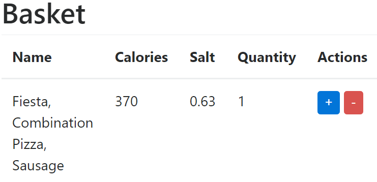
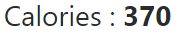
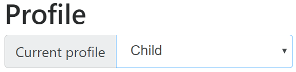
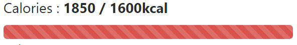
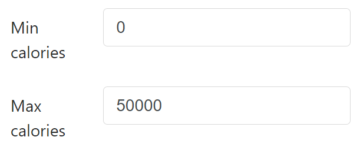
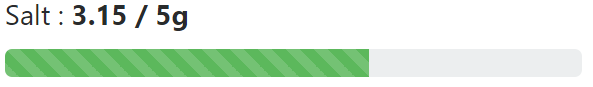
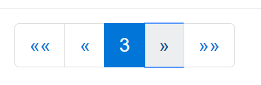

Calorie Meter
===============================

Un projet Knockout.js de calcul des calories créé en Mars 2017 par Kévin DESSIMOULIE.

Lien vers le sujet : http://www.unilim.fr/pages_perso/frederic.mora/js/frameworks/

Lien pour essayer l'application :
https://codepen.io/kde/pen/BWKvEX

Installation à partir du git
===============================

L'application est dépendante de plugin externes comme JQuery pour l'intéraction avec le serveur de Nutritionix ou Bootstrap qui fait le rendu de celle-ci, donc il faut penser à être connecté à internet.

Ensuite pour pouvoir mettre en marche l'application, il suffit d'ouvrir le index.html dans un navigateur et c'est partie.

Technologies utilisées
===============================

Knockout 3.2
-------------------------------

Le Calorie Meter est construit à partir du framework Knockout.


Knockout est une librarie JavaScript qui permet de créer des interfaces utilisateurs riches et responsives avec un modèle de données propre. A chaque fois que vous avez des sections de l'UI qui se met à jour dynamiquement (c'est à dire, l'utilisateur entreprend une action qui va modifier l'état de l'interface ou encore lorsque des données externes changent), Knockout peut vous aider à implémenter cela plus facilement et de façon entretenable.


Ce framework est composé, comme on peut le voir ci dessus, d'une architecture Model - View - ViewModel. Qui est aussi appelé dans le cas de Knockout Model – View – Binder car il sépare la vue du model par essentiellement un data-binder.

Nutritionix 1.1
-------------------------------


Nutritionix est une API permettant un accès à une base de données qui recense une grande quantité d'aliment. Ceci permettant un apport externe en données à l'application Calorie Meter et ainsi avoir un jeu d'essai pertinent.

Bootstrap 4
-------------------------------


Bootstrap est le framework le plus populaire du monde pour construire des sites et des applications responsifs et/ou mobiles-first. À l'intérieur vous trouverez un HTML, un CSS et un Javascript de grande qualité pour démarrer des projets plus facilement jamais.

JQuery 3.1.1
-------------------------------


JQuery est une librarie Javascript rapide, petite et riche en caractéristique. Il rend des choses comme la manipulation de document HTML et la gestion, le traitement d'événement, l'animation et Ajax beaucoup plus simples avec une API facile à utiliser qui fonctionne à travers une multitude de navigateurs. Avec une combinaison de polyvalence et l'extensibilité, jQuery a changé la façon que les millions personnes écrivent le Javascript.

Tether 1.1
-------------------------------

Tether est une dépendance de Bootstrap 4 principalement pour le rendu des select et de tooltips.

Caractéristiques
===============================

Barre de recherche
-------------------------------

#### Demande

> L'application présente un champ de saisie pour rechercher des aliments sur la base de mots clés.

#### Réalisation

##### A quoi ça resemble


La barre de recherche ci-dessus permet de chercher des aliments dans Nutritionix. 

##### Comment ça marche

- L'observateur
``` javascript
/** Ceci est l'observateur de Knockout sur le champ de saisie */
self.productSearched = ko.observable();
```

- Le champ de saisie
``` html
<!-- Ceci est le champ de saisie et ses data-bind
     data-bind :
         - value : {observable} productSearched L'observateur vu ci-dessus
-->
<input type="text" data-bind="value: productSearched"/>
```

Résultats d'une recherche
-------------------------------

#### Demande

> Le résultat d'une recherche apparaît sous la forme d'une liste dont les éléments sont sélectionnables.

#### Réalisation

##### A quoi ça resemble


Grâce au champ de saisie vu précédement on peut afficher des produits venu de nutritionix.

##### Comment ça marche

- L'observateur
``` javascript
/** Liste des produits */
self.productList = ko.observableArray();
```

- La classe Produit
``` javascript
/**
 * Classe produit
 *
 * @param {string} id       Id du produit
 * @param {string} name     Nom du produit
 * @param {number} calories Calories du produit
 * @param {number} salt     Sel du produit
 * @param {int}    quantity Quantité de produit
 * @constructor
 */
function Product(id, name, calories, salt, quantity = 1) {
    /** Variables pour éviter des comportement non voulu de this */
    let self = this;

    self.id = id;
    self.name = name;
    self.calories = calories;
    self.salt = salt;
    self.quantity = ko.observable(quantity);
}
```

- La fonction de récupération des données
``` javascript
/**
 * Fonction récupérant les produits de Nutritionix
 */
self.launchSearch = function () {
    /** Nombre d'élément à afficher dans la table (Peut aller jusqu'à max 20 avec Nutritionix) */
    let interval = 5;
    /** On calcule l'interval */
    let end = interval * self.productPaginate.page();
    let start = end - interval;
    /** Choix des champs ('*' pour les avoir tous) */
    let fields = "*";
    /** Mon appId et appKey pour accéder à Nutritionix */
    let appId = "d62702c9";
    let appKey = "3b33a35fc17e370e050895ced60c1798";
    /** On récupère ce qui se trouve dans l'observateur du champ de saisie */
    let product = self.productSearched();

    /** On vérifie si le champ n'est pas vide */
    if (!product) {
        product = '*';
    }

    /** La requète JQuery pour récupérer les produits dans Nutritionix */
    $.getJSON("https://api.nutritionix.com/v1_1/search/" + product +
        "?results=" + start + "%3A" + end +
        "&cal_min=" + 0 +
        "&cal_max=" + 50000 +
        "&fields=" + fields +
        "&appId=" + appId +
        "&appKey=" + appKey,
        function(data) {
            /** On supprime le contenu de l'observateur */
            self.productList.removeAll();

            /** Puis ajoute les résultats résupérés */
            data.hits.forEach(function (product) {
                /** On hydrate des objets de type Produit puis on les ajoute à l'observateur */
                self.productList.push(
                    new Product(
                        product.fields.item_id,
                        product.fields.brand_name + ", " + product.fields.item_name,
                        product.fields.nf_calories,
                        product.fields.nf_sodium/1000
                    ));
            })
        })
    ;
};
```

- Le tableau affichant les résultats
``` html
<table class="table">
    <thead>
        <tr>
            <th>Name</th>
            <th>Calories</th>
            <th>Salt</th>
        </tr>
    </thead>
    <!-- Affichage des produits
         data-bind :
            - foreach : {observableArray} productList On affiche chaque produits de l'observateur
    -->
    <tbody data-bind="foreach: productList">
    <tr>
        <!-- Affichage du nom
             data-bind :
                - text : {string} name Le nom du produit
        -->
        <td data-bind="text: name"></td>
        <!-- Affichage des calories
             data-bind :
                - text : {number} calories Les calories du produit
        -->
        <td data-bind="text: calories"></td>
        <!-- Affichage du sel
             data-bind :
                - text : {number} salt Le sel du produit
        -->
        <td data-bind="text: salt"></td>
    </tr>
    </tbody>
</table>
```

Garde manger
-------------------------------

#### Demande

> Les aliments sélectionnés par l'utilisateur sont placer dans le "garde manger" qui n'est ni plus ni moins que l'ensemble des aliments sélectionnés jusqu'à alors. Les aliments sont ajoutés avec une quantité unitaire par défaut. Mais il est possible de modifier cette quantité pour chaque aliment. Pour chaque aliment, l'apport calorifique est indiqué dynamiquement en tenant compte de la quantité choisie par l'utilisateur. Il est aussi possible de supprimer des aliments du garde manger. Toutes les modifications effectuées sur le garde manger modifie la valeur calorifique totale du garde manger qui est aussi tenue à jour dynamiquement.

#### Réalisation

##### A quoi ça resemble



Dans l'image de la liste des résultats on a pu voir une action représenté par un bouton bleu avec un +. Celui ci a permis d'ajouter un aliment au panier que l'on peut voir ci-dessus.



Et avec avec chaque actions, on peut soit augmenter, soit diminuer, voir supprimer, des éléments du panier. Ce qui change le total de calories du panier et qui est modifié en live.

##### Comment ça marche

- L'observateur
``` javascript
/** Le panier */
self.basketList = ko.observableArray();
```

- Les fonctions d'ajout et suppresion de produit
``` javascript
/**
 * Fonction d'ajout de produit
 *
 * @param product
 */
self.addProductToBasket = function (product) {
    /** On essaie de trouver le produit dans panier */
    let index = self.basketList.indexOf(product);

    /** On vérifie s'il existe */
    if(index > -1) {
        /** S'il existe déjà, on augmente sa quantité */
        self.basketList()[index].quantity(self.basketList()[index].quantity() + 1);
    } else {
        /** Sinon on l'ajoute */
        self.basketList.push(product);
    }
};

/**
 * Fonction de suppression de produit
 *
 * @param product
 */
self.removeProductOfBasket = function (product) {
    /** On récupère le produit dans le panier */
    let index = self.basketList.indexOf(product);
    /** On récupère sa quantité */
    let quantity = self.basketList()[index].quantity();

    /** On vérifie le nombre de produit présent dans le panier */
    if(quantity > 1) {
        /** S'il y en a plus d'un, on diminue sa quantité */
        self.basketList()[index].quantity(self.basketList()[index].quantity() - 1);
    } else {
        /** Sinon on le supprime */
        self.basketList.remove(product);
    }
};
```

- Le tableau affichant le panier
``` html
<table class="table">
   <thead>
   <tr>
       <th>Name</th>
       <th>Calories</th>
       <th>Salt</th>
       <th>Quantity</th>
       <th>Actions</th>
   </tr>
   </thead>
   <!-- Affichage des produits du panier
        data-bind :
           - foreach : {observableArray} basketListSliced On affiche chaque produit du panier
   -->
   <tbody data-bind="foreach: basketListSliced">
   <tr>
       <!-- Affichage du nom
            data-bind :
               - text : {string} name Le nom du produit
       -->
       <td data-bind="text: name"></td>
       <!-- Affichage des calories
            data-bind :
               - text : {number} calories Les calories du produit
       -->
       <td data-bind="text: calories"></td>
       <!-- Affichage du sel
            data-bind :
               - text : {number} salt Le sel du produit
       -->
       <td data-bind="text: salt"></td>
       <!-- Affichage de la quantité de produit
            data-bind :
               - text : {int} quantity La quantité de produit
       -->
       <td data-bind="text: quantity"></td>
       <td>
           <!-- Bouton pour augmenter le nombre de produit qui identique à celui dans les produits de résultat
                data-bind :
                   - click : {function} $root.addProductToBasket Augmente la quantité au clique
           -->
           <button type="button" data-bind="click: $root.addProductToBasket">+</button>
           <!-- Bouton pour diminuer le nombre de produit
                data-bind :
                   - click : {function} $root.removeProductOfBasket Diminue la quantité de produit ou l'enlève entièrement
           -->
           <button type="button" data-bind="click: $root.removeProductOfBasket">-</button>
       </td>
   </tr>
   </tbody>
</table>
```

- La variable mise à jour lors de l'ajout ou de l'enlèvement de produit
``` javascript
self.caloriesQuantity = ko.computed(function() {
   /** Initialisation de la quantité de calories */
   let quantity = 0;

   /** On calcule la quantité de calories dans le panier */
   ko.utils.arrayForEach(self.basketList(), function(product) {
       quantity += product.calories * product.quantity();
   });
   
   /** On retourne la quantité de calories */
   return quantity;
});
```

Navigation
-------------------------------

#### Demande

> Votre application est compatible avec les boutons de navigation (précédent/suivant) du navigateur web.

#### Réalisation

Je n'ai pas fait cette partie car je ne vois pas ce qui peut être fait puisque mon application est sur une seul page.

Profil utilisateur
-------------------------------

#### Demande

> L'application permet à l'utilisateur de choisir son profil afin de déterminer le nombre de calories journalier dont il a idéalement besoin. Pour ce on se basera sur des critères fonctions de l'âge et du sexe de l'utilisateur tel que définis ici : https://fr.wikipedia.org/wiki/Ration_alimentaire

#### Réalisation

##### A quoi ça resemble



Ci-dessus on peut voir un selecteur pour choisir le profil auquel on correspond.

##### Comment ça marche

- La classe Profile
``` javascript
/**
 * Classe Profile
 *
 * @param {string} name     Nom du profil
 * @param {number} calories Calories recommendées au profil
 * @param {number} salt     Sel recommendées au profil
 * @constructor
 */
function Profile(name, calories, salt) {
    let self = this;

    self.name = name;
    self.calories = calories;
    self.salt = salt;
}
```

- La liste des profils disponible
``` javascript
/** On ajoute tous les profils voulu à l'observateur */
self.availableProfiles = ko.observableArray([
    new Profile("Child", 1600, 5),
    new Profile("Teenage boy", 2900, 5),
    new Profile("Teenage girl", 2400, 5),
    new Profile("Man", 2800, 5),
    new Profile("Woman", 2200, 5),
    new Profile("Pregnant woman", 2400, 5),
    new Profile("Athletic man", 3300, 5),
    new Profile("Athletic woman", 2500, 5),
    new Profile("Old man", 2000, 5),
    new Profile("Old woman", 1800, 5),
]);
```

- L'observateur du profil courant
``` javascript
/** Profil courant sélection */
self.selectedProfile = ko.observable();
```

- Formulaire permettant de sélectionner son profil
``` html
<div class="input-group">
    <span class="input-group-addon" id="user_profile_label">Current profile</span>
    <!-- Selecteur de profile
         data-bind :
            - options :     {observableArray} availableProfiles On récupère la liste de profils disponible
            - optionsText : {observable}      selectedProfile   Le profil courant
            - value :       {string}          'name'            La valeur qui sera afficher dans le sélecteur
     -->
    <select class="form-control" id="user_profile" aria-describedby="user_profile_label" title="user_profile" data-bind="options: availableProfiles, value: selectedProfile, optionsText: 'name', event:{change: checkProfile}"></select>
</div>
```

Seuil d'alerte
-------------------------------

#### Demande

> L'application alerte l'utilisateur si la valeur calorifique de son garde manger excède l'apport journalier idéal défini par son profil. L'application affiche aussi en permanence combien de calories peuvent être encore ajoutée au garde manger avant d'atteindre le seuil d'alerte.

#### Réalisation

##### A quoi ça resemble



En fonction du profil sélectionner et du total dans le panier, on peut afficher les calories ainsi que leur évolution pour savoir où l'on en est et si l'on a dépassé.

##### Comment ça marche

- L'observateur de la progression
``` javascript
/** Status du profil courant */
self.caloriesProgress = ko.observable(0);
```

- La couleur du status du profil courant
``` javascript
self.caloriesStatus = ko.computed(function() {
    /** On vérifie si la progression est au maximum */
    if (self.caloriesProgress() > 100) {
        /** On annonce un surplus */
        return "bg-danger";
    } else {
        /** Le status est correct */
        return "bg-success";
    }
});
```

- On reprend la quantité dans le panier mais y ajoute le maximum du profil courant
``` javascript
self.caloriesQuantity = ko.computed(function() {
    let quantity = 0;
    /** Initialisation d'un maximum de calories moyens trouvé sur la page de Wikipedia */
    let maxCalories = 2500;

    ko.utils.arrayForEach(self.basketList(), function(product) {
        quantity += product.calories * product.quantity();
    });

    /** On vérifie si un profil est sélectionné */
    if (undefined != self.selectedProfile()) {
        /** Si oui, on peut donc modifier le maximum */
        maxCalories = self.selectedProfile().calories
    }

    /** On met à jour le status du profil */
    self.caloriesProgress(quantity * 100 / maxCalories);

    return quantity + " / " + maxCalories + "kcal";
});
```

- L'affichage des statistiques
``` html
<!-- La quantité de calories dans le panier par rapport au maximum recommendées pour le profil courant
     data-bind :
        - text : {computed} caloriesQuantity Les quantités de calories
-->
<label>Calories : <strong data-bind="text: caloriesQuantity"></strong></label>
<!-- Progression visuel de la quantité de calories -->
<div class="progress">
    <!-- Calories status
         data-bind :
            - style.width : {css}      { width: caloriesProgress() + '%' } Change la progression
            - css :         {computed} caloriesStatus                      Change la couleur en fonction de la progression et devient rouge si le maximum est dépassé
    -->
    <div class="progress-bar progress-bar-striped" role="progressbar" aria-valuemin="0" aria-valuemax="100" data-bind="style:{ width: caloriesProgress() + '%' }, css: caloriesStatus"></div>
</div>
```

Recherche bornée
-------------------------------

#### Demande

> L'application permet de rechercher des aliments mais en limitant les réponses aux aliments dont la valeur calorifique (unitaire) est inférieur à un maximum choisi par l'utilisateur.

#### Réalisation

##### A quoi ça resemble



En complément de la recherche par mot clés, on peut aussi créer un interval de calories pour sélectionner plus précisement le produit.

##### Comment ça marche

- Les observateurs des délimiteurs
``` javascript
/** Calories minimum recherchées */
self.minCalSearched = ko.observable(0);
/** Calories maximum recherchées */
self.maxCalSearched = ko.observable(50000);
```

- Le rôle de ces observateurs
``` javascript
/** On modifie la requète JQuery */
$.getJSON("https://api.nutritionix.com/v1_1/search/" + product +
    "?results=" + start + "%3A" + end +
    /** On les valeurs par défaut par les écouteurs des délimiteurs */
    "&cal_min=" + self.minCalSearched() +
    "&cal_max=" + self.maxCalSearched() +
    "&fields=" + fields +
    "&appId=" + appId +
    "&appKey=" + appKey,
    ...
};
```

- Les formulaires des délimiteurs
``` html
<!-- Formulaire pour délimiter le minimum de calories -->
<div class="form-group row">
    <label for="min_cal_searched" class="col-3 col-form-label">Min calories</label>
    <div class="col-9">
        <!-- Champ de saisie pour un nombre minimum de calories
             data-bind :
                - value :        {observable} minCalSearched Valeur de l'interval minimal
                - event.change : {function}   launchSearch   On lance une nouvelle recherche
        -->
        <input class="form-control" type="number" id="min_cal_searched" data-bind="value: minCalSearched, event:{change: launchSearch}"/>
    </div>
</div>

<!-- Formulaire pour délimiter le maximum de calories -->
<div class="form-group row">
    <label for="max_cal_searched" class="col-3 col-form-label">Max calories</label>
    <div class="col-9">
        <!-- Champ de saisie pour un nombre maximum de calories
             data-bind :
                - value :        {observable} maxCalSearched Valeur de l'interval maximal
                - event.change : {function}   launchSearch   On lance une nouvelle recherche
        -->
        <input class="form-control" type="number" id="max_cal_searched" data-bind="value: maxCalSearched, event:{change: launchSearch}"/>
    </div>
</div>
```

Informations complémentaires
-------------------------------

#### Demande

> En plus des calories, l'application calcule (chaque fois que possible) pour chaque aliment et pour l'ensemble du garde manger la quantité de graisses saturées et la quantité de sel (sodium). On mettra également un seuil d'alerte sur le sel sachant que l'OMS préconise un apport journalier inférieur à 5 grammes.

#### Réalisation

##### A quoi ça resemble



Pour le sel, c'est très similaire aux calories, voir identique.

##### Comment ça marche

Aller voir: Seuil d'alerte (On remplace calories par sel car on as les mêmes méquaniques pour ces deux éléments)

Module Supplémentaire
-------------------------------

### Une pagination

#### Réalisation

##### A quoi ça resemble



J'ai rajouté en une pagination qui fonctionne autant pour les résultats récupérés, bien que ce soit difficile, que pour le panier.

##### Comment ça marche

- La classe de pagination
``` javascript
/**
 * Classe Paginate
 *
 * @param {int}      page    Page courante
 * @param {int}      nbPages Nombre de page total
 * @param {function} handler Fonction appelée pour changer la page du tableau
 * @constructor
 */
function Paginate(page, nbPages, handler) {
    let self = this;

    self.page = ko.observable(page);
    self.nbPages = ko.observable(nbPages);
    self.handler = handler;

    /**
     * Fonction pour aller à la première page
     */
    self.first = function () {
        self.page(1);
        self.handler();
    };
    /**
     * Fonction pour aller à la page précédente
     */
    self.previous = function () {
        self.page(self.page() - 1);
        self.handler();
    };
    /**
     * Fonction pour aller à la page suivante
     */
    self.next = function () {
        self.page(self.page() + 1);
        self.handler();
    };
    /**
     * Fonction pour aller à la dernière page
     */
    self.last = function () {
        self.page(self.nbPages());
        self.handler();
    };
}
```

- Les observateurs de pagination
``` javascript
/** Product's paginate */
self.productPaginate = new Paginate(1, 0, function() {
    /** Fonction appelé pour changer la page des résultats */
    return self.launchSearch();
});
/** Basket's paginate */
self.basketPaginate = new Paginate(1, 0, function() {
    /** Fonction appelé pour changer la page du panier */
    return self.changePageBasket();
});
```

- Le template
``` html
<script type="text/html" id="pagination-template">
    <ul class="pagination justify-content-center">
        <!-- Elément contenant le bouton "première page"
             data-bind :
                - visible : {condition} page() > 2 Condition pour afficher le bouton pour aller à la première page
        -->
        <li class="page-item" data-bind="visible: page() > 2">
            <!-- Bouton pour aller à la première page
                 data-bind :
                    - click : {function} first Fonction allant à la première page
            -->
            <button class="page-link" aria-label="First" data-bind="click: first">
                <span aria-hidden="true">&laquo;&laquo;</span>
                <span class="sr-only">First</span>
            </button>
        </li>
        <!-- Elément contenant le bouton "page précédente"
             data-bind :
                - visible : {condition} page() > 1 Condition pour afficher le bouton pour aller à la page précédente
        -->
        <li class="page-item" data-bind="visible: page() > 1">
            <!-- Bouton pour aller à la page précédente
                 data-bind :
                    - click : {function} previous Fonction allant à la page précédente
            -->
            <button class="page-link" aria-label="Previous" data-bind="click: previous">
                <span aria-hidden="true">&laquo;</span>
                <span class="sr-only">Previous</span>
            </button>
        </li>
        <!-- Elément contenant le numéro de la page courrante -->
        <li class="page-item active">
            <!-- Affichage de la page courante
                 data-bind :
                    - text : {string} page Affiche le numéro de la page courante
            -->
            <button class="page-link" data-bind="text: page"></button>
        </li>
        <!-- Elément contenant le bouton "page suivante"
             data-bind :
                - visible : {condition} page() < nbPages() Condition pour afficher le bouton pour aller à la page suivante
        -->
        <li class="page-item" data-bind="visible: page() < nbPages()">
            <!-- Bouton pour aller à la page suivante
                 data-bind :
                    - click : {function} next Fonction allant à la page suivante
            -->
            <button class="page-link" aria-label="Next" data-bind="click: next">
                <span aria-hidden="true">&raquo;</span>
                <span class="sr-only">Next</span>
            </button>
        </li>
        <!-- Elément contenant le bouton "dernière page"
             data-bind :
                - visible : {condition} page() < nbPages() - 1 Condition pour afficher le bouton pour aller à la dernière page
        -->
        <li class="page-item" data-bind="visible: page() < nbPages() - 1">
            <!-- Bouton pour aller à la dernière page
                 data-bind :
                    - click : {function} last Fonction allant à la dernière page
            -->
            <button class="page-link" aria-label="Last" data-bind="click: last">
                <span aria-hidden="true">&raquo;&raquo;</span>
                <span class="sr-only">Last</span>
            </button>
        </li>
    </ul>
</script>
```

- L'affichage dans un tableau
``` html
<tfoot>
<tr>
    <!-- Affichage de la pagination
         data-bind :
            - template.name : {string}     'pagination-template'        Le template sélectionné
            - template.data : {observable} basketPaginate               Le Pzginate du panier
            - visible :       {condition}  basketPaginate.nbPages() > 1 La condition pour pouvoir afficher la pagination
    -->
    <td colspan="5" data-bind="template: { name: 'pagination-template', data: basketPaginate }, visible: basketPaginate.nbPages() > 1"></td>
</tr>
</tfoot>
```

Conclusion
===============================

Les frameworks sont très utiles mais doivent être mesuré pour ne pas les utiliser à mauvais escient. Ce projet est fort intéressant et je sais que des optimisations et refactorisations sont nécessaires. Pour cela il faudrait prendre du recul mais pendant que je développe cette application, je n'ai pas forcément un recul suffisant.
