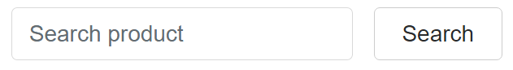
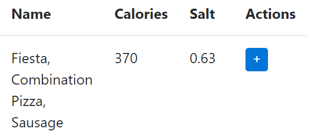

Calorie Meter
===============================

Un projet Knockout.js de calcul des calories créé en Mars 2017 par Kévin DESSIMOULIE.

Lien vers le sujet : http://www.unilim.fr/pages_perso/frederic.mora/js/frameworks/

Lien pour essayer l'application :
https://codepen.io/kde/pen/BWKvEX

Installation à partir du git
===============================

L'application est dépendante de plugin externes comme JQuery pour l'intéraction avec le serveur de Nutritionix ou Bootstrap qui fait le rendu de celle-ci, donc il faut penser à être connecté à internet.

Ensuite pour pouvoir mettre en marche l'application, il suffit d'ouvrir le index.html dans un navigateur et c'est partie.

Technologies utilisées
===============================

Knockout 3.2
-------------------------------

Le Calorie Meter est construit à partir du framework Knockout.


Knockout est une librarie JavaScript qui permet de créer des interfaces utilisateurs riches et responsives avec un modèle de données propre. A chaque fois que vous avez des sections de l'UI qui se met à jour dynamiquement (c'est à dire, l'utilisateur entreprend une action qui va modifier l'état de l'interface ou encore lorsque des données externes changent), Knockout peut vous aider à implémenter cela plus facilement et de façon entretenable.


Ce framework est composé, comme on peut le voir ci dessus, d'une architecture Model - View - ViewModel. Qui est aussi appelé dans le cas de Knockout Model – View – Binder car il sépare la vue du model par essentiellement un data-binder.

Nutritionix 1.1
-------------------------------


Nutritionix est une API permettant un accès à une base de données qui recense une grande quantité d'aliment. Ceci permettant un apport externe en données à l'application Calorie Meter et ainsi avoir un jeu d'essai pertinent.

Bootstrap 4
-------------------------------


Bootstrap est le framework le plus populaire du monde pour construire des sites et des applications responsifs et/ou mobiles-first. À l'intérieur vous trouverez un HTML, un CSS et un Javascript de grande qualité pour démarrer des projets plus facilement jamais.

JQuery 3.1.1
-------------------------------


JQuery est une librarie Javascript rapide, petite et riche en caractéristique. Il rend des choses comme la manipulation de document HTML et la gestion, le traitement d'événement, l'animation et Ajax beaucoup plus simples avec une API facile à utiliser qui fonctionne à travers une multitude de navigateurs. Avec une combinaison de polyvalence et l'extensibilité, jQuery a changé la façon que les millions personnes écrivent le Javascript.

Tether 1.1
-------------------------------

Tether est une dépendance de Bootstrap 4 principalement pour le rendu des select et de tooltips.

Caractéristiques
===============================

Barre de recherche
-------------------------------

#### Demande

> L'application présente un champ de saisie pour rechercher des aliments sur la base de mots clés.

#### Réalisation

##### A quoi ça resemble



La barre de recherche ci-dessus permet de chercher des aliments dans Nutritionix. 

##### Comment ça marche

- L'observateur
``` javascript
/** Ceci est l'observateur de Knockout sur le champ de saisie */
self.productSearched = ko.observable();
```

- Le champ de saisie
``` html
<!-- Ceci est le champ de saisie et ses data-bind
     data-bind :
         - value : {observable} productSearched L'observateur vu ci-dessus
-->
<input type="text" data-bind="value: productSearched"/>
```

Résultats d'une recherche
-------------------------------

#### Demande

> Le résultat d'une recherche apparaît sous la forme d'une liste dont les éléments sont sélectionnables.

#### Réalisation

##### A quoi ça resemble



Grâce au champ de saisie vu précédement on peut afficher des produits venu de nutritionix.

##### Comment ça marche

- L'observateur
``` javascript
/** Liste des produits */
self.productList = ko.observableArray();
```

- La classe Produit
``` javascript
/**
 * Classe produit
 *
 * @param {string} id       Id du produit
 * @param {string} name     Nom du produit
 * @param {number} calories Calories du produit
 * @param {number} salt     Sel du produit
 * @param {int}    quantity Quantité de produit
 * @constructor
 */
function Product(id, name, calories, salt, quantity = 1) {
    /** Variables pour éviter des comportement non voulu de this */
    let self = this;

    self.id = id;
    self.name = name;
    self.calories = calories;
    self.salt = salt;
    self.quantity = ko.observable(quantity);
}
```

- La fonction de récupération des données
``` javascript
/**
 * Fonction récupérant les produits de Nutritionix
 */
self.launchSearch = function () {
    /** Nombre d'élément à afficher dans la table (Peut aller jusqu'à max 20 avec Nutritionix) */
    let interval = 5;
    /** On calcule l'interval */
    let end = interval * self.productPaginate.page();
    let start = end - interval;
    /** Choix des champs ('*' pour les avoir tous) */
    let fields = "*";
    /** Mon appId et appKey pour accéder à Nutritionix */
    let appId = "d62702c9";
    let appKey = "3b33a35fc17e370e050895ced60c1798";
    /** On récupère ce qui se trouve dans l'observateur du champ de saisie */
    let product = self.productSearched();

    /** On vérifie si le champ n'est pas vide */
    if (!product) {
        product = '*';
    }

    /** La requète JQuery pour récupérer les produits dans Nutritionix */
    $.getJSON("https://api.nutritionix.com/v1_1/search/" + product +
        "?results=" + start + "%3A" + end +
        "&cal_min=" + 0 +
        "&cal_max=" + 50000 +
        "&fields=" + fields +
        "&appId=" + appId +
        "&appKey=" + appKey,
        function(data) {
            /** On supprime le contenu de l'observateur */
            self.productList.removeAll();

            /** Puis ajoute les résultats résupérés */
            data.hits.forEach(function (product) {
                /** On hydrate des objets de type Produit puis on les ajoute à l'observateur */
                self.productList.push(
                    new Product(
                        product.fields.item_id,
                        product.fields.brand_name + ", " + product.fields.item_name,
                        product.fields.nf_calories,
                        product.fields.nf_sodium/1000
                    ));
            })
        })
    ;
};
```

- Le tableau affichant les résultats
``` html
<table class="table">
    <thead>
        <tr>
            <th>Name</th>
            <th>Calories</th>
            <th>Salt</th>
        </tr>
    </thead>
    <!-- Affichage des produits
         data-bind :
            - foreach : {observableArray} productList On affiche chaque produits de l'observateur
    -->
    <tbody data-bind="foreach: productList">
    <tr>
        <!-- Affichage du nom
             data-bind :
                - text : {string} name Le nom du produit
        -->
        <td data-bind="text: name"></td>
        <!-- Affichage des calories
             data-bind :
                - text : {number} calories Les calories du produit
        -->
        <td data-bind="text: calories"></td>
        <!-- Affichage du sel
             data-bind :
                - text : {number} salt Le sel du produit
        -->
        <td data-bind="text: salt"></td>
    </tr>
    </tbody>
</table>
```

Garde manger
-------------------------------

#### Demande

> Les aliments sélectionnés par l'utilisateur sont placer dans le "garde manger" qui n'est ni plus ni moins que l'ensemble des aliments sélectionnés jusqu'à alors. Les aliments sont ajoutés avec une quantité unitaire par défaut. Mais il est possible de modifier cette quantité pour chaque aliment. Pour chaque aliment, l'apport calorifique est indiqué dynamiquement en tenant compte de la quantité choisie par l'utilisateur. Il est aussi possible de supprimer des aliments du garde manger. Toutes les modifications effectuées sur le garde manger modifie la valeur calorifique totale du garde manger qui est aussi tenue à jour dynamiquement.

#### Réalisation

##### A quoi ça resemble

##### Comment ça marche

Navigation
-------------------------------

#### Demande

> Votre application est compatible avec les boutons de navigation (précédent/suivant) du navigateur web.

#### Réalisation

Je n'ai pas fait cette partie car je ne vois pas ce qui peut être fait puisque mon application est sur une seul page.

Profil utilisateur
-------------------------------

#### Demande

> L'application permet à l'utilisateur de choisir son profil afin de déterminer le nombre de calories journalier dont il a idéalement besoin. Pour ce on se basera sur des critères fonctions de l'âge et du sexe de l'utilisateur tel que définis ici : https://fr.wikipedia.org/wiki/Ration_alimentaire

#### Réalisation

##### A quoi ça resemble

##### Comment ça marche

Seuil d'alerte
-------------------------------

#### Demande

> L'application alerte l'utilisateur si la valeur calorifique de son garde manger excède l'apport journalier idéal défini par son profil. L'application affiche aussi en permanence combien de calories peuvent être encore ajoutée au garde manger avant d'atteindre le seuil d'alerte.

#### Réalisation

##### A quoi ça resemble

##### Comment ça marche

Recherche bornée
-------------------------------

#### Demande

> L'application permet de rechercher des aliments mais en limitant les réponses aux aliments dont la valeur calorifique (unitaire) est inférieur à un maximum choisi par l'utilisateur.

#### Réalisation

##### A quoi ça resemble

##### Comment ça marche

Informations complémentaires
-------------------------------

#### Demande

> En plus des calories, l'application calcule (chaque fois que possible) pour chaque aliment et pour l'ensemble du garde manger la quantité de graisses saturées et la quantité de sel (sodium). On mettra également un seuil d'alerte sur le sel sachant que l'OMS préconise un apport journalier inférieur à 5 grammes.

#### Réalisation

##### A quoi ça resemble

##### Comment ça marche
